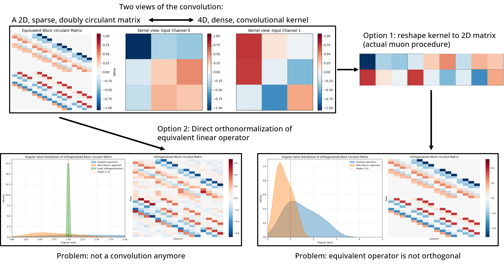

# muon_conv2

This repository investigates a specific mismatch between Muon theory and its practical use on convolutional layers.

For dense matrices, Muon applies a Newton-Schulz style orthogonalization step to the update. For convolutions, the common practical shortcut is to reshape a `k_h x k_w` kernel into a matrix, orthogonalize that matrix, and reshape it back. The core claim of this repo is that this shortcut is not equivalent to orthogonalizing the actual convolution operator.

The notebook [walkthrough.ipynb](walkthrough.ipynb) is the main explanation. It shows both the problem and the proposed fix.

## Section 1: the problem

### 1. Convolutions are linear operators

A convolution is not just a small kernel tensor. It is a linear operator acting on images, and can be represented as a large structured matrix with Toeplitz / block-circulant structure.

The video [assets/ConvolutionToToeplitz.mp4](assets/ConvolutionToToeplitz.mp4) illustrates this viewpoint.

<video src="assets/ConvolutionToToeplitz.mp4" controls muted loop width="720">
  Your browser does not support embedded video. Open
  <a href="assets/ConvolutionToToeplitz.mp4">ConvolutionToToeplitz.mp4</a>.
</video>

### 2. The current procedure does not produce orthonormal convolution updates

If we reshape a convolution kernel into a dense matrix, apply Newton-Schulz, and reshape back, the resulting kernel is generally **not** the polar factor of the true convolution operator.

This discrepancy is illustrated in [assets/problem_framing.png](assets/problem_framing.png) and explored in detail in [walkthrough.ipynb](walkthrough.ipynb).



In other words:

- Muon theory says we should orthogonalize the operator.
- The practical convolution trick orthogonalizes a reshaped tensor instead.
- Those are not the same object.

### 3. Existing convolution variants do not resolve the underlying issue

Several convolution-friendly Muon variants exist, but this repo argues that they do not address the deep structural problem: the update should respect the geometry of convolution operators themselves, not only the geometry of a flattened kernel tensor.

## Section 2: our approach

Our approach is to reimplement the order-3 Newton-Schulz-style update directly in the convolutional domain, in a way that is exactly equivalent to applying Newton-Schulz to the associated Toeplitz / block-circulant operator.

The practical idea is:

1. Work with convolution kernels as convolution operators, not flattened matrices.
2. Reproduce the Newton-Schulz update using convolution and transposed convolution primitives.
3. Insert a projection after each step so the iterate stays in the space of fixed-size `k_h x k_w` kernels.

This gives an alternating-projection style procedure:

- one step moves toward orthogonality in operator space,
- one projection brings the iterate back to the manifold of valid `k_h x k_w` kernels.

The implementation lives in [airbench94_conv_muon.py](airbench94_conv_muon.py), mainly through `orthogonalize_kernel_beta(...)`.

## Section 3: bug or feature?

At the moment, it is hard to draw strong empirical conclusions.

The current CIFAR-10 speedrun setup was tuned for the older approximation, and some prior comparisons use a biased baseline around `91%`. In this repo, the current tuned configuration reaches about `93.95%`, which is competitive but not decisive.

The main caveat is that this regime appears heavily limited by overfitting:

- a faster optimizer may simply overfit faster,
- better optimization does not automatically translate into better final accuracy,
- optimizer comparisons are hard to interpret when the training recipe itself is not retuned.

So the current answer is: maybe bug, maybe feature, but not enough evidence yet.

More experiments are needed to determine whether the gap between theory and practice is merely harmless approximation, or whether it hides a real optimization issue for convolutional Muon.

## Repository contents

- [walkthrough.ipynb](walkthrough.ipynb): conceptual walkthrough of the discrepancy and the proposed convolutional orthogonalization.
- [airbench94_conv_muon.py](airbench94_conv_muon.py): CIFAR-10 training script with the convolutional Muon variant.
- [experiment_logbook.md](experiment_logbook.md): experiment history and observed validation accuracy.
- [user_thoughts_and directions.md](user_thoughts_and%20directions.md): working hypotheses and research notes.
- [assets/ConvolutionToToeplitz.mp4](assets/ConvolutionToToeplitz.mp4): visualization of convolution as a linear operator.
- [assets/problem_framing.png](assets/problem_framing.png): summary image of the mismatch.

## Running the code

The repo contains a local environment helper in [scripts/env.sh](scripts/env.sh). A typical run looks like:

```bash
source scripts/env.sh
python airbench94_conv_muon.py --run-name my-run
```

Useful knobs exposed by the training script include:

- `--aug-translate`
- `--muon-lr`
- `--adam-weight-decay-scale`
- `--muon-weight-decay-scale`
- `--num-runs`
- `--epochs`

The script will download CIFAR-10 automatically if needed and logs runs through Weights & Biases.

## Current status

This repo should be read as an investigation, not as a finished optimizer package.

The main result so far is conceptual:

- flattening a convolution kernel and orthogonalizing it is not the same as orthogonalizing the convolution operator,
- this difference can be made explicit on small tractable examples,
- a convolution-domain orthogonalization procedure can be implemented efficiently enough to test in practice.

The open question is whether this more faithful construction improves learning once the entire training recipe is retuned for it.
