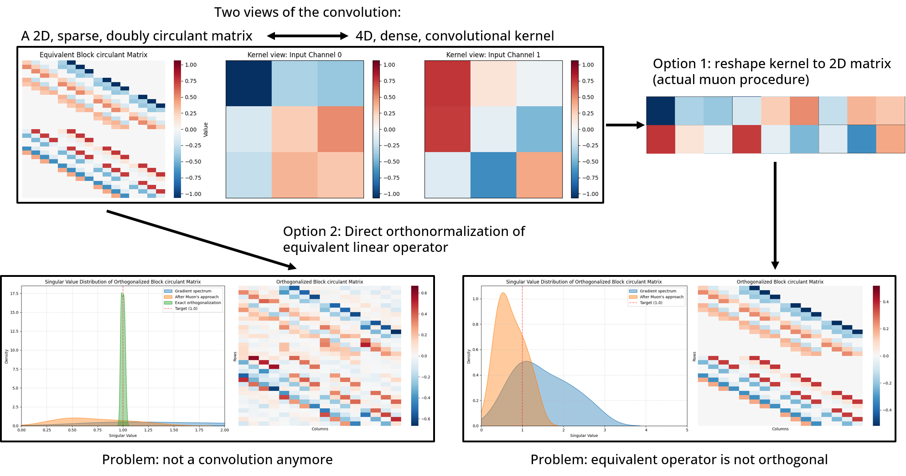

# Muon is not Muon when applied to convolutions

This repository investigates a specific mismatch between Muon theory and its practical use on convolutional layers.

For dense matrices, Muon applies a Newton-Schulz style orthogonalization step to the update. For convolutions, the common practical shortcut is to reshape a `k_h x k_w` kernel into a matrix, orthogonalize that matrix, and reshape it back. The core claim of this repo is that this shortcut is not equivalent to orthogonalizing the actual convolution operator.

The notebook [walkthrough.ipynb](walkthrough.ipynb) is the main explanation. It shows both the problem and the proposed fix.

## Section 1: the problem

### 1. Convolutions are linear operators

A convolution is not just a small kernel tensor. It is a linear operator acting on images, and can be represented as a large structured matrix with Toeplitz / block-circulant structure.

This video illustrates this viewpoint. 

[ConvolutionToToeplitz](https://github.com/user-attachments/assets/aeb91805-b90a-430e-b392-c2b68d0bef85)

### 2. The current procedure does not produce orthonormal convolution updates

If we reshape a convolution kernel into a dense matrix, apply Newton-Schulz, and reshape back, the resulting kernel is generally **not** the polar factor of the true convolution operator.

This discrepancy is illustrated in [assets/problem_framing.png](assets/problem_framing.png) and explored in detail in [walkthrough.ipynb](walkthrough.ipynb).



In other words:

- Muon theory says we should orthogonalize the operator.
- The practical convolution trick orthogonalizes a reshaped tensor instead.
- Those are not the same object.

### 3. Existing convolution variants do not resolve the underlying issue

Several convolution-friendly Muon variants exist, but this repo argues that they do not address the deep structural problem: the update should respect the geometry of convolution operators themselves, not only the geometry of a flattened kernel tensor.

## Section 2: our approach

Our approach is to rewrite the order-3 Newton-Schulz-style update directly in the convolutional domain. In a way that is exactly equivalent to applying Newton-Schulz to the associated Toeplitz / block-circulant operator coupled with a projection over fixed size kernels.

The practical idea is:

1. Work with convolution kernels as convolution operators, not flattened matrices.
2. Reproduce the Newton-Schulz update using convolution and transposed convolution primitives.
3. Insert a projection after each step so the iterate stays in the space of fixed-size `k_h x k_w` kernels.

This gives an alternating-projection style procedure:

- one step moves toward orthogonality in operator space,
- one projection brings the iterate back to the manifold of valid `k_h x k_w` kernels.

The implementation lives in [airbench94_conv_muon.py](airbench94_conv_muon.py), mainly through `orthogonalize_kernel_beta(...)`.


## Section 3: bug or feature?

At the moment, it is hard to draw strong empirical conclusions.

I have noticed that some prior comparisons use a modified baseline reaching around `91%`. While this protocol ensures a repeatable setup, I do prefer a comparison against the original baseline by @KellerJordan which obtains `94%`, and performs multiple runs to compute mean/std. In this repo, the current tuned configuration reaches about `93.98%`, which is competitive but not decisive.

The main caveat is that this regime appears heavily limited by overfitting:

- a faster optimizer may simply overfit faster (note that our implementation reaches `93.64` when we reduce to only 7 epochs)
- better optimization does not automatically translate into better final accuracy

So the current answer is: maybe bug, maybe feature, but not enough evidence yet.

More experiments are needed to determine whether the gap between theory and practice is merely harmless approximation, or whether it hides a real optimization issue for convolutional Muon.

## Running the code

The repo contains a local environment helper in [scripts/env.sh](scripts/env.sh). A typical run looks like:

```bash
source scripts/env.sh
python airbench94_conv_muon.py --run-name my-run
```

Useful knobs exposed by the training script include:

- `--aug-translate`
- `--muon-lr`
- `--adam-weight-decay-scale`
- `--muon-weight-decay-scale`
- `--num-runs`
- `--epochs`

The script will download CIFAR-10 automatically if needed and logs runs through Weights & Biases.

The current default train a model that reaches around 94% validation accuracy (see the `run_log.txt`), in a competitive runtime (here without compilation)

```
---------------------------------------------------------------------------------
|  run     |  epoch  |  train_acc  |  val_acc  |  tta_val_acc  |  time_seconds  |
---------------------------------------------------------------------------------
|       0  |      0  |     0.6895  |   0.6360  |               |        0.5603  |
|          |      1  |     0.7920  |   0.7457  |               |        1.1151  |
|          |      2  |     0.8495  |   0.7864  |               |        1.6693  |
|          |      3  |     0.8650  |   0.7813  |               |        2.1903  |
|          |      4  |     0.8955  |   0.8591  |               |        2.7107  |
|          |      5  |     0.9250  |   0.9068  |               |        3.2317  |
|          |      6  |     0.9445  |   0.9212  |               |        3.7522  |
|          |      7  |     0.9730  |   0.9319  |               |        4.2733  |
|          |   eval  |     0.9730  |   0.9319  |       0.9388  |        4.4502  |
---------------------------------------------------------------------------------

...

---------------------------------------------------------------------------------
|      23  |      0  |     0.7110  |   0.6214  |               |        0.5637  |
|          |      1  |     0.8185  |   0.7530  |               |        1.1215  |
|          |      2  |     0.8360  |   0.8291  |               |        1.6788  |
|          |      3  |     0.8860  |   0.8046  |               |        2.2027  |
|          |      4  |     0.9005  |   0.8550  |               |        2.7261  |
|          |      5  |     0.9175  |   0.9025  |               |        3.2501  |
|          |      6  |     0.9470  |   0.9214  |               |        3.7735  |
|          |      7  |     0.9720  |   0.9325  |               |        4.2975  |
|          |   eval  |     0.9720  |   0.9325  |       0.9406  |        4.4755  |
---------------------------------------------------------------------------------
|      24  |      0  |     0.6870  |   0.6638  |               |        0.5637  |
|          |      1  |     0.8030  |   0.7579  |               |        1.1216  |
|          |      2  |     0.8365  |   0.7621  |               |        1.6789  |
|          |      3  |     0.8560  |   0.8106  |               |        2.2029  |
|          |      4  |     0.8835  |   0.8353  |               |        2.7263  |
|          |      5  |     0.9225  |   0.9021  |               |        3.2503  |
|          |      6  |     0.9470  |   0.9241  |               |        3.7736  |
|          |      7  |     0.9710  |   0.9326  |               |        4.2976  |
|          |   eval  |     0.9710  |   0.9326  |       0.9418  |        4.4757  |
---------------------------------------------------------------------------------
Mean: 0.9398    Std: 0.0009
```

## Current status

The main result so far is conceptual:

- flattening a convolution kernel and orthogonalizing it is not the same as orthogonalizing the convolution operator,
- this difference can be made explicit on small tractable examples,
- a convolution-domain orthogonalization procedure can be implemented efficiently an yield competitive results.

## Citation
```
@misc{lin2025flash,
  author       = {Thibaut Boissin},
  title        = {Muon is not Muon when applied to convolutions},
  year         = {2026},
  url          = {https://github.com/thib-s/muonconv-cifar10-airbench}
}
```
